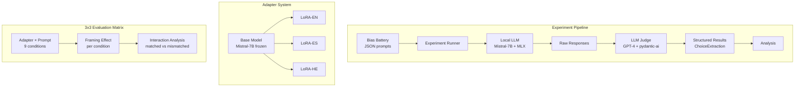
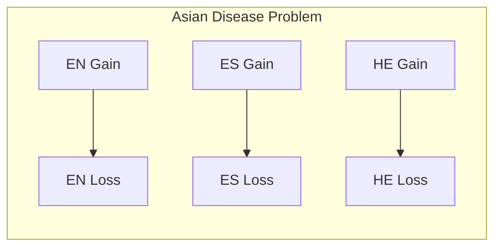
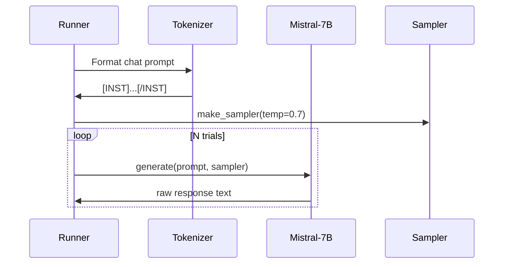
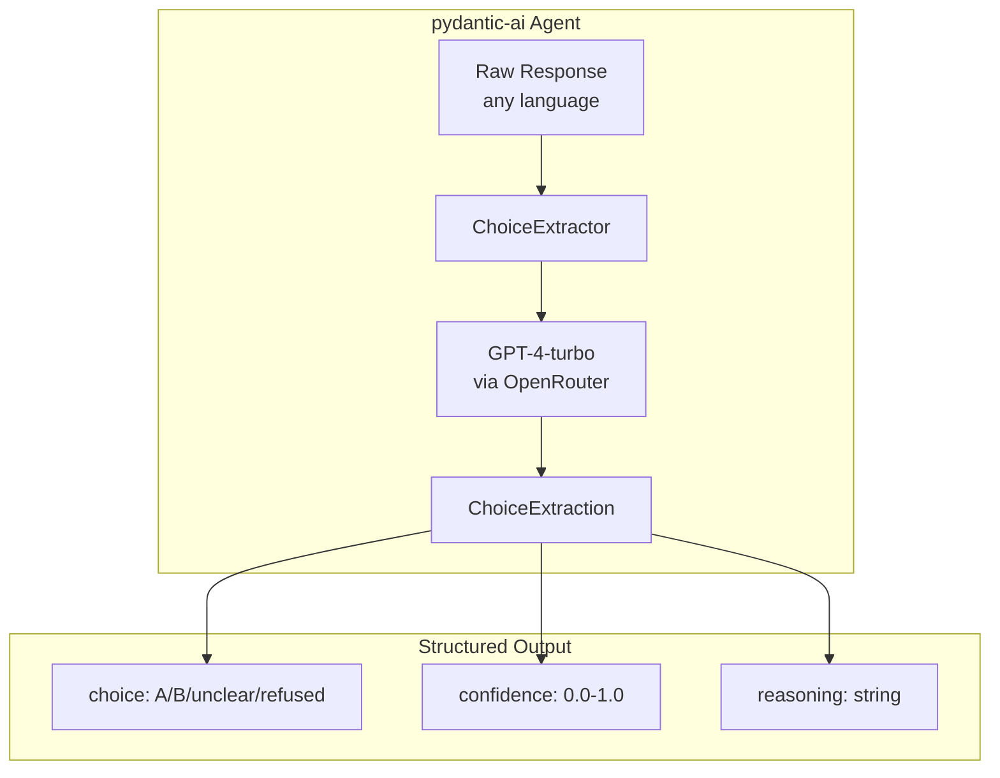
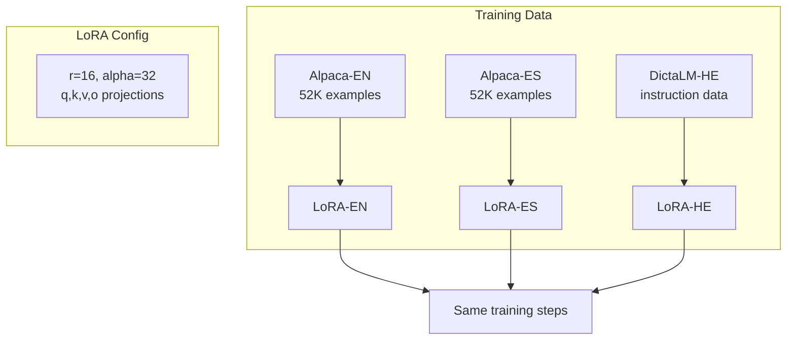
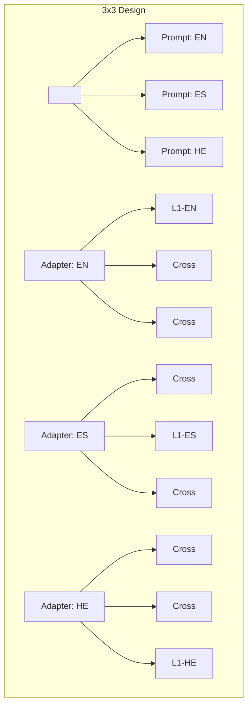

# Piensa Architecture

## Overview

Piensa tests the Foreign Language Effect (FLE) hypothesis in LLMs using language-specific LoRA adapters. The core insight: prompting in a language does not simulate a native speaker of that language. We need adapter-prompt mismatch to create the L1/L2 distinction.

## System Architecture



## Component Details

### 1. Bias Battery



Prompts stored in code (`src/run_asian_disease.py`) with identical semantic content across languages and frames. Each prompt asks for forced choice A or B.

### 2. Local LLM Inference



- **Framework**: MLX (Apple Silicon optimized)
- **Model**: `mlx-community/Mistral-7B-Instruct-v0.3-4bit`
- **Sampling**: Temperature > 0 for response distributions

### 3. LLM Judge (Choice Extraction)



Why LLM judge instead of heuristics:
- Language agnostic (works for Hebrew, Arabic, Chinese...)
- Semantic understanding ("the first option" = A)
- Confidence scores for uncertain extractions
- Audit trail via reasoning field

### 4. Adapter Training (Planned)



Critical invariants:
- Same base model (frozen)
- Same LoRA hyperparameters
- Same training duration
- Only training data differs

### 5. Evaluation Matrix



| | EN Prompt | ES Prompt | HE Prompt |
|---|---|---|---|
| **EN Adapter** | L1 (matched) | Cross (L2 sim) | Cross (L2 sim) |
| **ES Adapter** | Cross (L2 sim) | L1 (matched) | Cross (L2 sim) |
| **HE Adapter** | Cross (L2 sim) | Cross (L2 sim) | L1 (matched) |

**Hypothesis**: Diagonal (matched) shows stronger framing effects than off-diagonal (mismatched), analogous to L1 > L2 in humans.

## Data Flow

```mermaid
flowchart LR
    subgraph Input
        A[Prompt<br/>language + frame]
        B[Adapter<br/>language]
    end

    subgraph Inference
        C[Load adapter]
        D[Generate N responses<br/>temp > 0]
    end

    subgraph Extraction
        E[LLM Judge<br/>batch extract]
        F[ChoiceExtraction<br/>per response]
    end

    subgraph Analysis
        G[P(A), P(B)<br/>per condition]
        H[Framing Effect<br/>P(B|loss) - P(B|gain)]
        I[Interaction<br/>matched vs mismatched]
    end

    A --> C
    B --> C
    C --> D
    D --> E
    E --> F
    F --> G
    G --> H
    H --> I
```

## File Structure

```
piensa/
├── src/
│   ├── agents/
│   │   ├── __init__.py
│   │   └── choice_extractor.py    # LLM judge
│   ├── models/
│   │   ├── __init__.py
│   │   └── choice.py              # Pydantic models
│   ├── run_asian_disease.py       # Experiment runner
│   └── test_choice_extractor.py   # Judge tests
├── docs/
│   ├── architecture.md            # This file
│   └── scenarios/
│       └── asian_disease.md       # Deep dive on ADP
├── results/                       # JSON experiment outputs
├── adapters/                      # Saved LoRA weights (future)
├── EXPERIMENT_1.md               # Paper writeup
└── .env                          # API keys (gitignored)
```

## Key Design Decisions

### 1. LLM Judge over Heuristics

The heuristic `extract_choice()` had 16-31% unclear rate and would fail on non-Latin scripts. GPT-4 as judge provides:
- Semantic parsing in any language
- Structured Pydantic output
- Confidence calibration
- ~$0.30 per full experiment run

### 2. Adapter-Prompt Mismatch as FLE Analog

Prompting in Spanish does not make the model a "Spanish speaker." The adapter encodes a language-specific processing mode. Mismatch between adapter training language and prompt language is the analog of L2 processing in humans.

### 3. Temperature > 0 for Distributions

At temperature=0, we only see the mode. Temperature=0.7 with 100 trials per condition reveals the underlying response distribution, enabling statistical analysis of framing effects.

### 4. Forced Choice Format

"Answer with only 'A' or 'B'" ensures extractable responses. Free-form responses would require subjective interpretation of intent.
